# Yolo Application: Google Kubernetes Engine

This project deploys a full-stack application (React frontend, Node.js backend, MongoDB) on Google Kubernetes Engine.

## Live Demo

The application is deployed and accessible at:  
**http://34.71.103.12/**

## Architecture

- **Frontend**: React application served on port 3000 internally load-balanced to external ip 80
- **Backend**: Node.js API server on port 5000  
- **Database**: MongoDB StatefulSet with persistent storage
- **Infrastructure**: Google Kubernetes Engine (GKE)

## Prerequisites

- Google Cloud Platform account
- `gcloud` CLI installed and configured
- `kubectl` CLI installed
- Docker (for building images)

## Screenshots

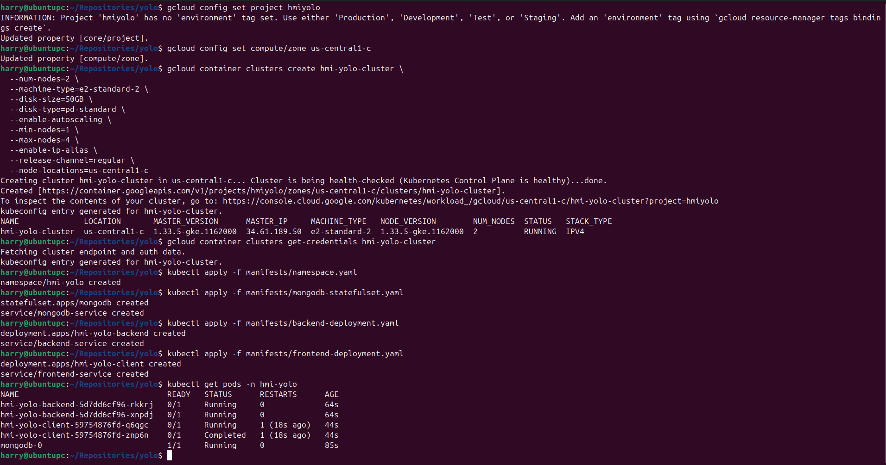

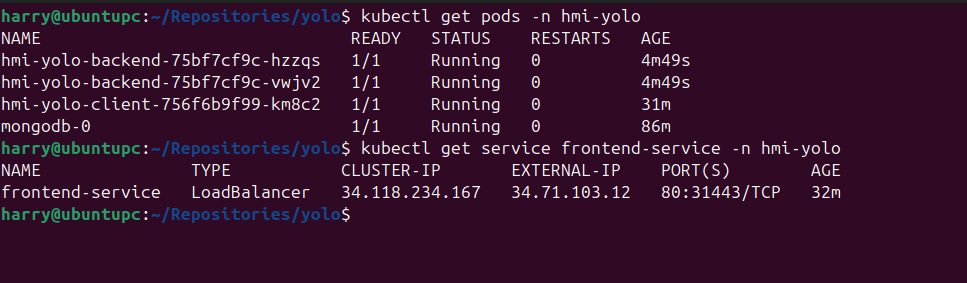

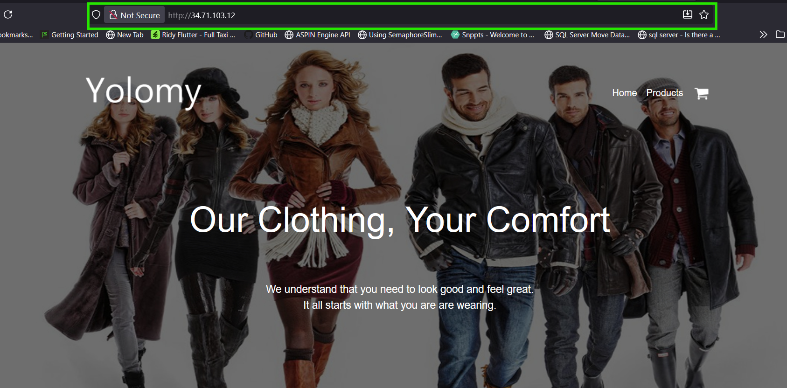

## Quick Start

### 1. Set up GCP Project

```bash
# Set your project
gcloud config set project XXXXXX
gcloud config set compute/zone us-central1-c

# Enable required APIs
gcloud services enable \
  container.googleapis.com \
  compute.googleapis.com \
  storage.googleapis.com \
  cloudresourcemanager.googleapis.com \
  iam.googleapis.com

# Create cluster with optimized settings
gcloud container clusters create hmi-yolo-cluster \
  --zone us-central1-c \
  --num-nodes=2 \
  --machine-type=e2-standard-2 \
  --disk-size=50GB \
  --enable-autoscaling \
  --min-nodes=1 \
  --max-nodes=4 \
  --enable-ip-alias

# Get Cluster Credentials
gcloud container clusters get-credentials hmi-yolo-cluster --zone us-central1-c
```

### 2. Apply all configurations

```bash
# Namespace
kubectl apply -f manifests/namespace.yaml

# DB
kubectl apply -f manifests/mongodb-statefulset.yaml

# Backend
kubectl apply -f manifests/backend-deployment.yaml

# Frontend
kubectl apply -f manifests/frontend-deployment.yaml
```

### 3. Check Deployment Status

```bash
# Check all resources
kubectl get all -n hmi-yolo

# Check pod status
kubectl get pods -n hmi-yolo

# Check services
kubectl get svc -n hmi-yolo

# Get external IP for frontend
kubectl get service frontend-service -n hmi-yolo -w
```

### 4. Check Logs

```bash
# Backend logs
kubectl logs -l app=hmi-yolo-backend -n hmi-yolo -f

# Frontend logs  
kubectl logs -l app=hmi-yolo-client -n hmi-yolo -f

# MongoDB logs
kubectl logs -l app=mongodb -n hmi-yolo -f
```

### 5. Scaling Management Commands

```bash
# Scale backend
kubectl scale deployment hmi-yolo-backend -n hmi-yolo --replicas=3

# Scale frontend
kubectl scale deployment hmi-yolo-client -n hmi-yolo --replicas=3
```

### 2. Cleanup resources

```bash
# Namespace
kubectl delete -f manifests/namespace.yaml

# DB
kubectl delete -f manifests/mongodb-statefulset.yaml

# Backend
kubectl delete -f manifests/backend-deployment.yaml

# Frontend
kubectl delete -f manifests/frontend-deployment.yaml
```

---

# Yolo Application: Ansible

This project implements a modern, three-tier web application with a Node.js + Express backend and a MongoDB database, all deployed within a fully automated, multi-machine virtualized environment.

The architecture is built on a microservices principle, where each core component (frontend, backend and database) runs in its own dedicated, isolated Ubuntu virtual machine. The entire infrastructure is provisioned, configured, and containerized automatically using a powerful Ansible automation pipeline.

## Core Technology Stack

- Application: Node.js, Express.js, MongoDB
- Virtualization: Vagrant (Multi-VM)
- Containerization: Docker
- Automation & Orchestration: Ansible

## Screenshots

### Client Build Images on DockerHub

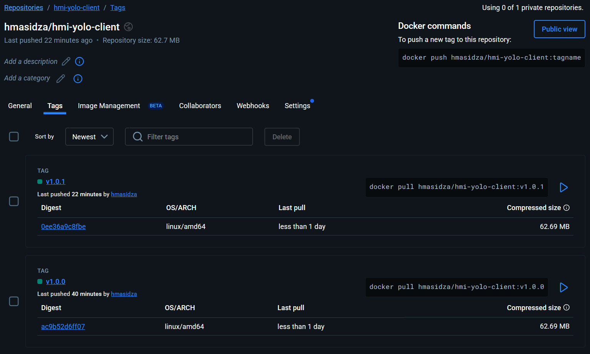

### Backend Build Images on DockerHub

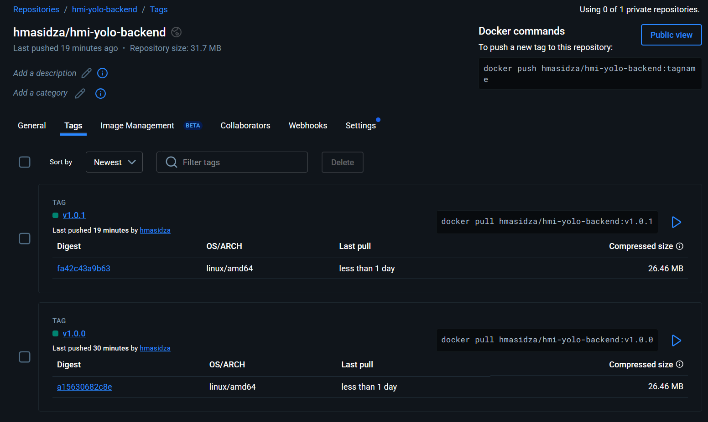

### Vagrant up command

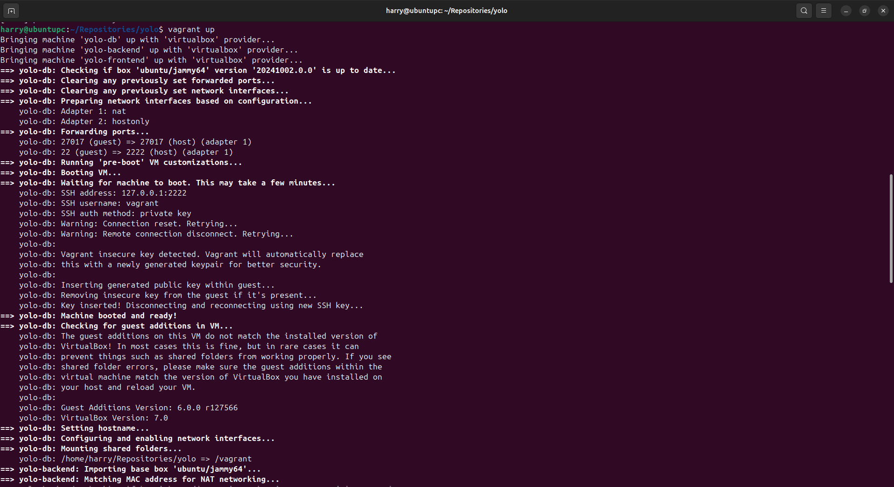

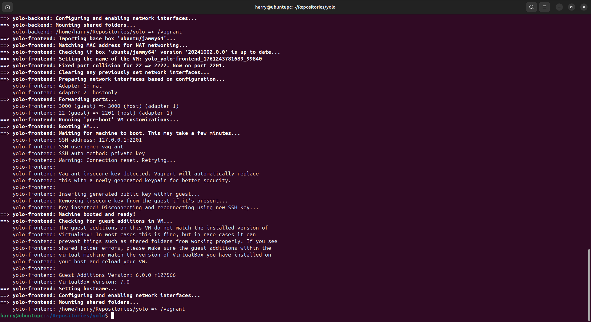

### Ansible-playbook commands

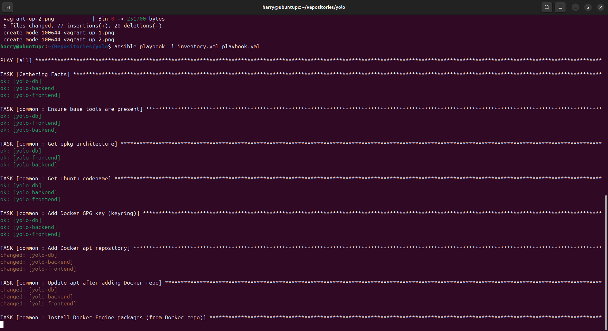

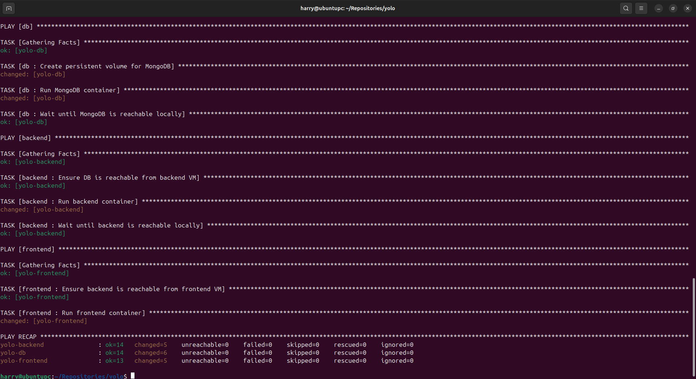

### Running application on port 3000 of frontend VM

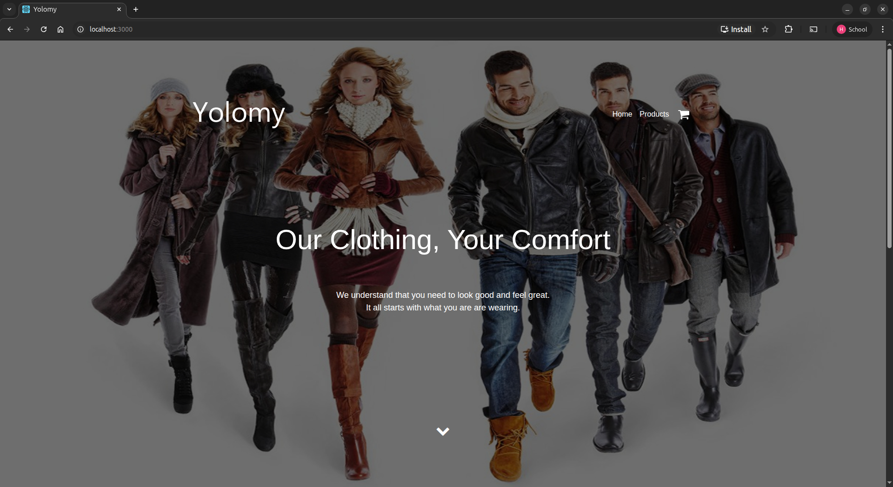

### Added product during test

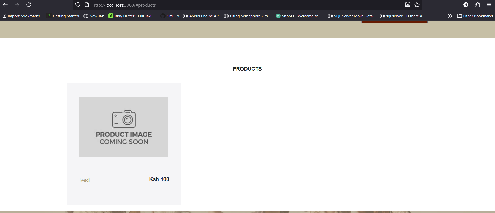

---

## Ansible + Vagrant

Each VM runs a single service container: MongoDB, Backend and Frontend using Docker provisioned automatically with Ansible roles.
- Ansible common role installs Docker and required dependencies.
- DB role runs mongo container, exposing port 27017.
- Backend role runs hmasidza/hmi-yolo-backend container and connects to MongoDB using the DB VM’s private IP.
- Frontend role runs hmasidza/hmi-yolo-client container and communicates with the backend.
- Startup order is guaranteed by Ansible’s wait_for tasks:
- Backend waits until MongoDB is reachable.
- Frontend waits until backend is reachable.

### Overview

| VM Name        | Role / Service  | IP Address      | Host Port     | Description                                 |
|----------------|-----------------|-----------------|---------------|---------------------------------------------|
| `yolo-db`      | MongoDB         | 192.168.56.10   | 27017 → 27017 | Database container with persistent volume   |
| `yolo-backend` | API Backend     | 192.168.56.11   | 5000 → 5000   | Backend container linked to MongoDB         |
| `yolo-frontend`| React Frontend  | 192.168.56.12   | 3000 → 3000   | Client container connected to backend       |

Each role contains its own `tasks/main.yml` and `defaults/main.yml` for separation of concerns and reusability.

### Prerequisites

Before starting, install these on the host machine:

- **VirtualBox**
- **Vagrant**
- **Ansible**
- **Python 3 + pip**
- Internet access to pull Docker images

Check installations:

```bash
vagrant --version

ansible --version
```

### Start VMs

```bash
vagrant up
```

### Install required Ansible collection(This is run just once)

```bash
ansible-galaxy install -r requirements.yml
```

### Run the playbook

```bash
ansible-playbook -i inventory.yml playbook.yml
```

The playbook executes in the following order:
- Common role: Installs Docker and Python Docker SDK on all VMs
- DB role: Runs MongoDB container with persistent storage
- Backend role: Deploys backend container and connects it to MongoDB
- Frontend role: Deploys frontend container and points it to backend API

### Access the Services

- Frontend: http://localhost:3000
- Backend: http://localhost:5000
- MongoDB: mongodb://localhost:27017

### Configuration

```yaml
mongo_image: "mongo:6.0"
backend_image: "hmasidza/hmi-yolo-backend:v1.0.1"
frontend_image: "hmasidza/hmi-yolo-client:v1.0.1"
mongo_port: "27017"
backend_port: "5000"
frontend_port: "3000"
tz: "Africa/Nairobi"
```

You can also adjust:
- Static VM IPs (must match Vagrantfile)
- Container environment variables
- Port mappings for host accessibility

### Useful Commands

| Command                                                         | Purpose                              |
| --------------------------------------------------------------- | ------------------------------------ |
| `vagrant up`                                                    | Start and provision all 3 VMs        |
| `vagrant halt`                                                  | Stop all VMs                         |
| `vagrant destroy -f`                                            | Remove all VMs                       |
| `vagrant ssh yolo-db`                                           | SSH into a specific VM               |
| `ansible-playbook -i inventory.yml playbook.yml`                | Apply provisioning manually          |
| `ansible-playbook -i inventory.yml playbook.yml --tags backend` | Run only a specific role (if tagged) |
| `docker ps` (inside a VM)                                       | View running containers              |

### Re-provisioning

To reapply changes after editing roles or vars:

```bash
ansible-playbook -i inventory.yml playbook.yml
```

or, from scratch:

```bash
vagrant destroy -f

vagrant up
```

### Troubleshooting

| Issue                    | Possible Fix                                               |
| ------------------------ | ---------------------------------------------------------- |
| VM creation fails        | Ensure VirtualBox + Vagrant are installed and updated      |
| SSH authentication error | Re-run `vagrant up` or check inventory paths               |
| Docker modules not found | Run `ansible-galaxy install -r requirements.yml`           |
| Containers not running   | SSH into VM → `sudo docker ps -a`                          |
| Port conflict            | Change host ports in `Vagrantfile` or `group_vars/all.yml` |

### Common Error

VirtualBox can't operate in VMX root mode.Please disable the KVM kernel extension, recompile your kernel and reboot.
(VERR_VMX_IN_VMX_ROOT_MODE).

If you are using an Intel CPU

```bash
sudo modprobe -r kvm_intel
```

If you are using an AMD CPU

```bash
sudo modprobe -r kvm_amd
```

---

# Yolo Application: Docker-Compose

## Prerequisites

- [Docker](https://docs.docker.com/get-docker/) (version 20.10+)

- [Docker Compose](https://docs.docker.com/compose/install/) (version 2.0+)

---

## Docker-Compose Quick Start

Clone the repository (if not already done)

Start - Stop the application

### Start all services

```bash
docker compose up
```

### Start in detached mode

```bash
docker compose up -d
```

### Stop all services

```bash
docker compose down
```

### Stop and remove volumes

```bash
docker compose down -v
```

### View running services

```bash
docker compose ps
```

## Manual commands to build and push images to DockerHub

To test functionality locally first

```bash
docker build -t hmasidza/hmi-yolo-client:v1.0.0 ./client
```

```bash
docker push hmasidza/hmi-yolo-client:v1.0.0
```

```bash
docker build -t hmasidza/hmi-yolo-backend:v1.0.0 ./backend
```

```bash
docker push hmasidza/hmi-yolo-backend:v1.0.0
```