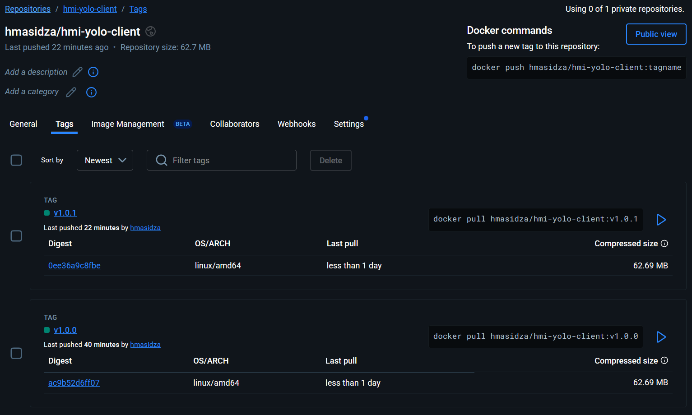
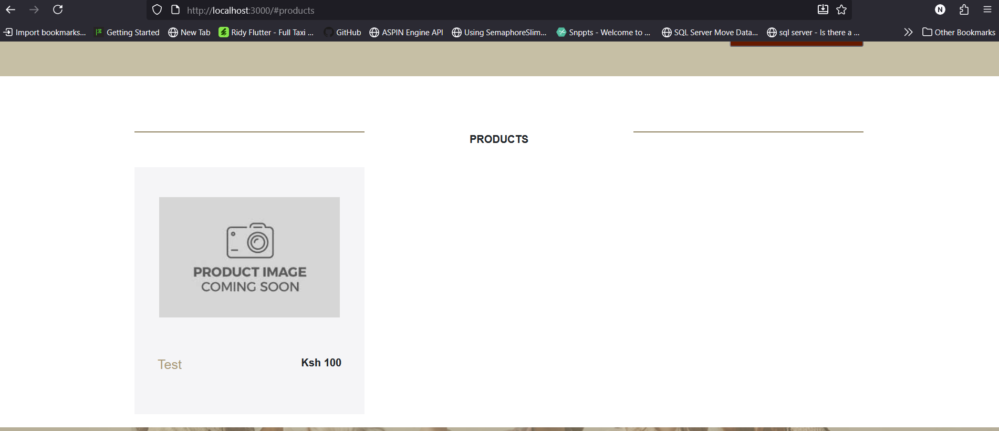

# Explanation

## 1. Dockerfile directives and what they are doing

### FROM

Initializes a new build stage and sets the Base Image for subsequent instructions

### WORKDIR

Sets the working directory for all RUN, CMD, ENTRYPOINT, COPY, and ADD instructions in the current stage. It helps us remove the need to keep writing long absolute paths.

### COPY

Copies files from local directory into the image.

```COPY . .``` – copies the entire project into the image

```COPY package*.json ./``` – copies only dependency manifests which is good for cache

```COPY --from=build /usr/src/app /app``` – multi-stage: copies artifacts from the build stage

### RUN

Used to execute commands during the build process of a Docker image and these commands are used to install software, configure the environment, and perform other setup tasks required for the application to run.

### EXPOSE

Explicitly declares the ports that the application inside the container is designed to use for communication. This helps other developers or users understand how to interact with the containerized service.

For our case it is:
- Client: 3000
- Backend: 5000

### CMD

What to run when the container starts

```CMD ["node", "server.js"]``` instructs the Docker container to start a Node.js application by executing the ```server.js``` file with the Node.js runtime.

```CMD ["npm", "start"]``` tells Docker to run the ```npm start``` command when a container built from this Dockerfile starts

## 2. How to achieve small images

```bash
FROM alpine:3.16.7
COPY --from=build /usr/src/app /app
```

Starts from a smaller Alpine base and copies only the output we need. Resulting in a smaller and a cleaner runtime image.

## 4. Why the MongoDB URL needed to change in source code

When running the app locally, we used 
```bash 
mongodb://localhost:27017/yolo
```

However, once we start using Docker Compose, each service runs in its own container with its own isolated network namespace.
From the backend container’s perspective, ```localhost``` now points to itself, not to the MongoDB container.

That’s why the backend couldn’t connect when it still used ```mongodb://localhost:27017```
To fix that, we must use the service name defined in ```docker-compose.yml``` 
In our case ```mongodb``` because Docker Compose automatically sets up internal DNS records for all services in the same network.

Hence the change to
```bash
mongodb://mongodb:27017/yolo
```

## 5. Screenshots

#### Client Images on DockerHub


#### Backend Images on DockerHub


#### Added product (during test)


## 6. Manual commands to build and push images to DockerHub
To test functionality locally first

```bash
docker build -t hmasidza/hmi-yolo-client:v1.0.0 ./client
```

```bash
docker push hmasidza/hmi-yolo-client:v1.0.0
```

```bash
docker build -t hmasidza/hmi-yolo-backend:v1.0.0 ./backend
```

```bash
docker push hmasidza/hmi-yolo-backend:v1.0.0
```